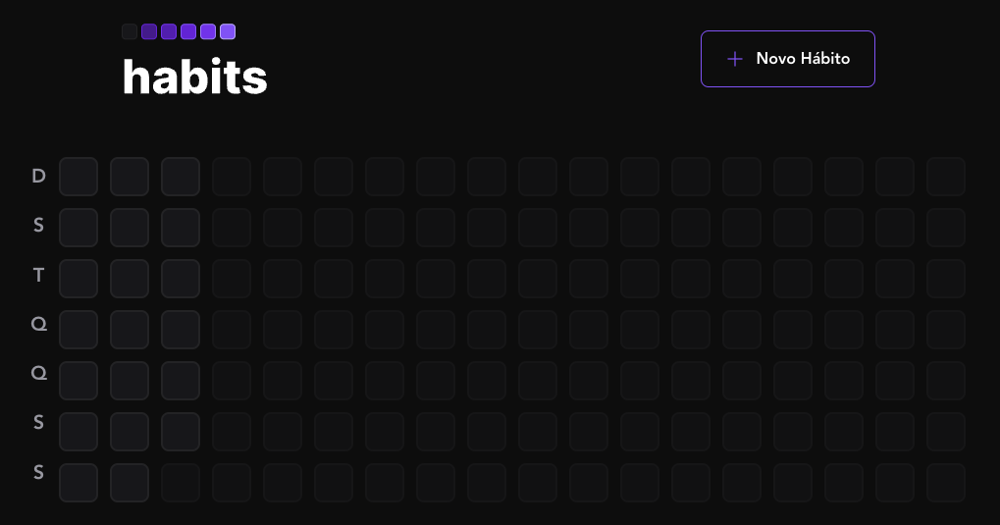

# Habits

Project developed during NLW Setup from RocketSeat.

This project covers [backend](https://github.com/caetanoburjack/habits-server) with nodeJs and Prisma, FrontEnd with ReactJS for web and ReactNative for [mobile](https://github.com/caetanoburjack/habits-mobile).

### Some libs and techs used on the project

* phosphor-react
* tailwindcss
* typescript
* [vite](https://vitejs.dev/guide/)
* [radix](https://www.radix-ui.com/docs/primitives/overview/introduction)
